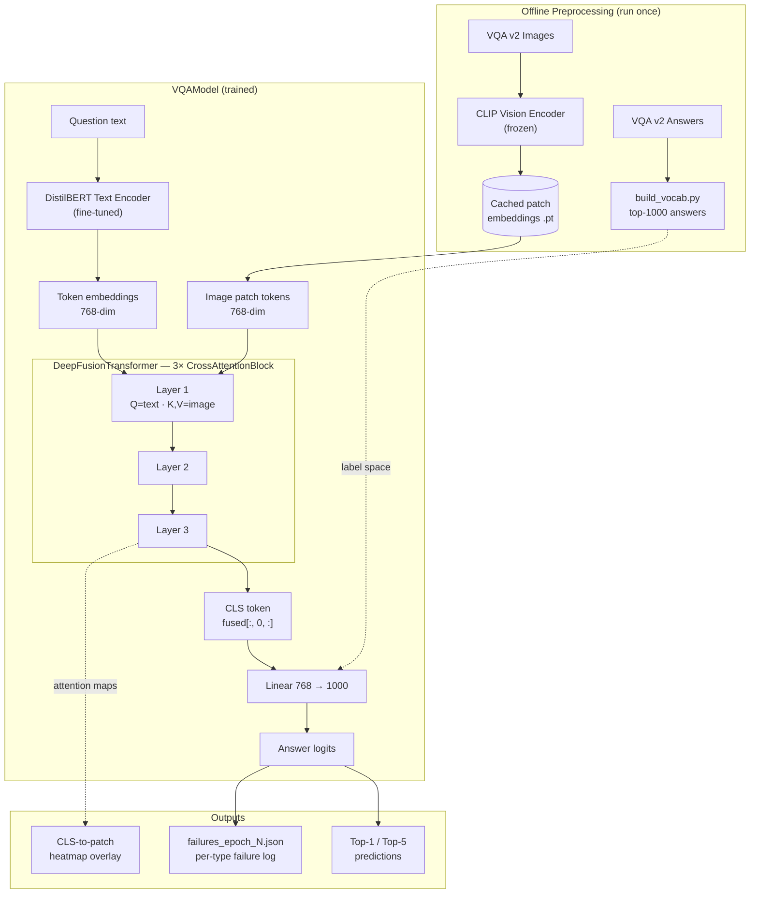
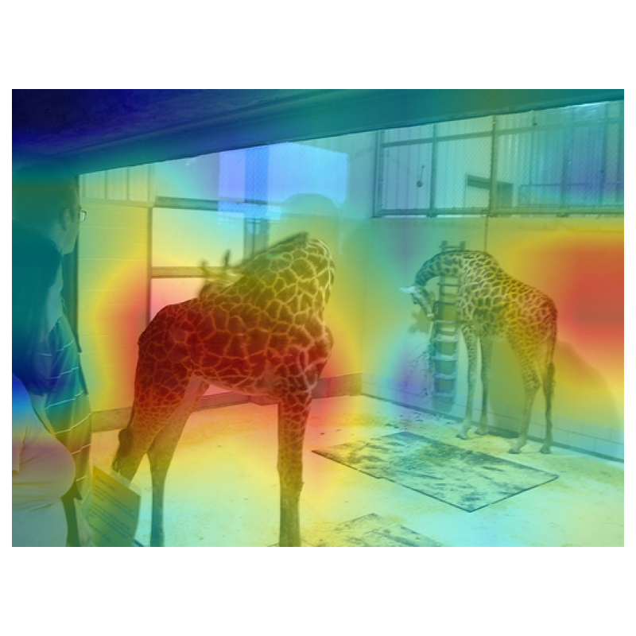

<div align="center">

# Deep Multimodal Visual Question Answering (VQA)

**A multimodal transformer that answers natural-language questions about images — built from scratch with a custom cross-attention fusion stack over frozen CLIP vision features and a fine-tuned DistilBERT text encoder.**

[](https://www.python.org/)
[](https://pytorch.org/)
[-412991.svg)](https://github.com/openai/CLIP)
[](https://huggingface.co/distilbert-base-uncased)
[](https://visualqa.org/)

[Architecture](#-architecture) · [Results](#-results) · [Interpretability](#-interpretability-attention-heatmaps) · [Installation](#-installation) · [Usage](#-usage)

</div>

---

## Table of Contents

- [The Problem](#-the-problem)
- [The Solution](#-the-solution)
- [Features](#-features)
- [Design Decisions](#-design-decisions)
- [Architecture](#-architecture)
- [Interpretability: Attention Heatmaps](#-interpretability-attention-heatmaps)
- [Installation](#-installation)
- [Usage](#-usage)
- [Example Output](#-example-output)
- [Results](#-results)
- [Project Structure](#-project-structure)
- [Technologies](#-technologies)
- [Roadmap](#-roadmap)
- [Contact](#-contact)

---

## The Problem

Visual Question Answering sits at the intersection of two hard problems: a model must *see* an image, *parse* a natural-language question, and *reason jointly across both* to produce an answer. The difficulty is that vision and language live in entirely different embedding spaces — a naive approach (concatenate the two feature vectors, feed to a classifier) throws away the spatial and token-level structure that the answer usually depends on.

## The Solution

A purpose-built fusion architecture where **question tokens attend directly to image patches**, layer after layer, before any prediction is made:

```
Image → CLIP patches ┐
                     ├→ 3× Cross-Attention Fusion → CLS token → 1000-class answer
Question → DistilBERT┘
```

Every component is implemented and trained here — the cross-attention block, the fusion stack, the training loop, the per-answer-type evaluation, and the attention-overlay visualizer — rather than fine-tuning an off-the-shelf VQA head.

## Features

**Multimodal Modeling**
- Custom `CrossAttentionBlock` — multi-head attention + residual LayerNorm + feed-forward, written from scratch in PyTorch
- `DeepFusionTransformer` — 3 stacked cross-attention layers (768-dim, 8 heads, dropout 0.1) that iteratively refine the question representation against the image
- Frozen CLIP vision encoder, fine-tuned DistilBERT text encoder — a deliberate transfer-learning split (see [Design Decisions](#-design-decisions))

**Training Efficiency**
- CLIP image embeddings are **precomputed offline** (`precompute_subset_embeddings.py`) and cached to disk, so the vision tower runs once per image instead of once per epoch
- Answer vocabulary built from corpus frequency (`build_vocab.py`) into a fixed 1000-class label space
- Unanswerable/out-of-vocab labels masked out of the loss (`label != -1`) rather than silently trained against

**Evaluation Depth**
- Top-1 and Top-5 accuracy, plus a **per-answer-type breakdown** (yes/no, number, other) — a single accuracy figure hides where a VQA model actually fails
- **Failure analysis logs** dumped per epoch (`failures_epoch_*.json`) to make error patterns inspectable rather than aggregate

**Interpretability**
- CLS-to-patch attention weights extracted from the fusion layers and overlaid on the source image as a heatmap
- CLI inference tool that emits the annotated image alongside Top-1/Top-5 predictions

## Design Decisions

| Component | Decision | Reasoning |
|---|---|---|
| CLIP vision encoder | **Frozen**, precomputed | CLIP's visual features are already strong and general; fine-tuning them on a VQA subset risks catastrophic forgetting with no data to justify it. Freezing also lets embeddings be cached, cutting training cost substantially. |
| DistilBERT text encoder | **Fine-tuned** | VQA questions have a distinctive distribution ("how many…", "what color…") that benefits from task adaptation — and the text tower is small enough to tune affordably. |
| Fusion direction | **Text queries, image keys/values** | The question determines *what to look for*; letting question tokens attend over image patches matches that asymmetry. Bidirectional fusion was not needed to produce a usable CLS representation. |
| Fusion depth | **3 layers** | Multiple passes let the question representation be refined against the image iteratively instead of in a single shot. |
| Prediction head | **1000-class classification** | Standard for VQA v2 — the long tail of open-ended answers is where accuracy collapses, which the per-type evaluation makes visible rather than hiding. |

## Architecture


<details>
<summary><b>Detailed pipeline view (Mermaid)</b></summary>



</details>

**Inside a single `CrossAttentionBlock`:**

```
text_tokens ──┐
              ├─► MultiheadAttention(Q=text, K=image, V=image) ──► + residual ──► LayerNorm
image_tokens ─┘                                                                      │
                                                                                     ▼
                                              LayerNorm ◄── + residual ◄── FFN(768 → 3072 → 768)
```

Each layer returns both the refined token sequence **and** its attention weights — which is what makes the heatmap visualization possible without a separate instrumentation pass.

## Interpretability: Attention Heatmaps

The model surfaces *where it looked*. CLS-to-patch attention weights from the fusion stack are reshaped to the CLIP patch grid, upsampled, and alpha-blended over the original image:

```
Input image + question  →  attention overlay  →  result.png
```



This turns "the model got it wrong" into "the model was looking at the wrong region" — a debuggable statement.

## Installation

**Requirements:** Python 3.10+ · PyTorch · a CUDA GPU strongly recommended for training

```bash
git clone https://github.com/Stevemeg/Deep-Multimodal-VQA.git
cd Deep-Multimodal-VQA

python -m venv venv
# Windows: .\venv\Scripts\Activate.ps1  |  Linux/macOS: source venv/bin/activate
pip install -r requirements.txt
```

Then download the [VQA v2](https://visualqa.org/download.html) images and question/answer JSON into your data directory.

## Usage

```bash
# 1. Build the answer vocabulary (top-1000 answers)
python -m src.build_vocab

# 2. Precompute + cache frozen CLIP embeddings (run once, saves training time)
python -m src.precompute_train_subset_embeddings
python -m src.precompute_subset_embeddings

# 3. Train — checkpoints and per-epoch failure logs are written each epoch
python run_train.py

# 4. Sanity-check the model components (shape/wiring verification scripts)
python tests/test_fusion.py         # cross-attention output + attention-map shapes
python tests/test_full_model.py     # end-to-end forward pass
python tests/test_text_encoder.py
python tests/test_embedding_dataset.py
python tests/test_loader.py
```

**Inference (CLI):**

```bash
python inference.py \
  --checkpoint checkpoints/best_model.pth \
  --embedding path_to_embedding.pt \
  --image path_to_image.jpg \
  --question "What color is the bus?" \
  --output result.png
```

## Example Output

```
Question: What color is the bus?

Top-1: red                     (0.412)
Top-5: red, yellow, white, blue, green

Attention overlay written to result.png
```

## Results

Evaluated on a VQA v2 subset. All figures are real training outputs, not projections.

| Metric | Score |
|---|---|
| **Top-1 Accuracy** | **~27–33%** |
| **Top-5 Accuracy** | **~65%** |
| Yes/No Accuracy | ~50% |
| Number Accuracy | ~22% |
| Other (open-ended) Accuracy | ~7% |

**Reading these numbers honestly:** the per-type split is the interesting part. Yes/no sits near the binary-chance floor, number answers are weak, and open-ended "other" answers collapse — the same shape reported across the published VQA literature, where the long tail of open-ended answers dominates the error budget. A single headline accuracy would have hidden all of that. The per-epoch failure logs (`failures_epoch_*.json`) exist so those cases can be read individually rather than summarized away.

Trained on a subset rather than full VQA v2, with a frozen vision tower and a 1000-class head — these are the constraints the numbers should be read against.

## Project Structure

```
Deep-Multimodal-VQA/
│
├── src/
│   ├── models/
│   │   ├── vision_encoder.py                     # CLIP patch-embedding extraction
│   │   ├── text_encoder.py                       # DistilBERT token embeddings
│   │   ├── fusion.py                             # CrossAttentionBlock + DeepFusionTransformer
│   │   └── vqa_model.py                          # Full model: text → fusion → classifier
│   ├── training/
│   │   └── train.py                              # Training loop, Top-1/Top-5 metrics, failure logging
│   ├── vqa_dataset.py                            # Dataset over cached embeddings
│   ├── build_vocab.py                            # Top-1000 answer vocabulary
│   ├── precompute_subset_embeddings.py           # Cache CLIP embeddings (eval subset)
│   └── precompute_train_subset_embeddings.py     # Cache CLIP embeddings (train subset)
│
├── tests/                                        # Shape/wiring verification scripts (run directly, not via pytest)
│   ├── test_fusion.py                            # Cross-attention output + attention-map shapes
│   ├── test_full_model.py                        # End-to-end forward pass
│   ├── test_text_encoder.py
│   ├── test_embedding_dataset.py
│   └── test_loader.py
│
├── run_train.py                                  # Training entry point
├── inference.py                                  # CLI inference + attention overlay
├── failures_epoch_1.json                         # Per-epoch failure analysis logs
├── failures_epoch_2.json
├── failures_epoch_3.json
├── result.png                                    # Sample attention-overlay output
├── assests/architecture.png.png                  # Architecture diagram
└── requirements.txt
```

## Technologies

Python · PyTorch (`nn.MultiheadAttention`, AdamW) · Hugging Face Transformers (CLIP, DistilBERT) · OpenCV (heatmap overlay) · NumPy · Matplotlib · tqdm · Pillow

## Roadmap

| Status | Milestone |
|---|---|
| ✅ | Custom cross-attention fusion · precomputed CLIP embeddings · per-answer-type evaluation · failure-analysis logging · attention heatmap overlay · CLI inference · component shape-verification scripts |
| ☐ | Convert `tests/` from print-based verification scripts into assertion-based pytest cases runnable in CI |
| ☐ | Train on full VQA v2 rather than a subset |
| ☐ | Bidirectional fusion (image tokens attending back over text) as an ablation |
| ☐ | Generative decoding for open-ended answers instead of fixed 1000-class classification |
| ☐ | Larger vision-language backbone (BLIP-2, LLaVA) as a baseline comparison |
| ☐ | Web interface for image upload + live question answering |

## Contact

**Kona Bharath Vamshidhar Reddy**
B.E. Artificial Intelligence & Machine Learning · Acharya Institute of Technology
[konabharath2004@gmail.com](mailto:konabharath2004@gmail.com) · [LinkedIn](https://www.linkedin.com/in/kona-bharath-vamshidhar-reddy/) · [GitHub](https://github.com/Stevemeg)

---

<div align="center"><sub>Built on the principle that a model should be able to show you where it looked.</sub></div>
